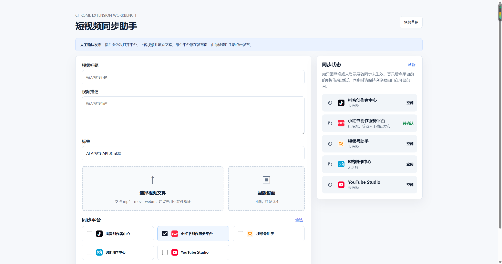

# 短视频自动发布助手

短视频自动发布助手是一款本地运行的 Chrome MV3 扩展工作台，用于把同一条短视频资料同步到抖音、小红书、视频号、B站和 YouTube 后台。它覆盖多平台自动发布流程里最耗时的上传、标题、描述、标签和封面填充环节，适合作为小红书自动发布、抖音自动发布、视频号自动发布、B站自动发布、Youtube自动发布的本地辅助工具。

> 当前策略：插件负责打开平台、上传视频并填充表单；每个平台最终仍停留在发布页，由你人工确认后点击发布，避免误发、错发和平台规则风险。



## 核心能力

- 一次填写标题、描述、标签、视频文件和竖版封面，减少多平台重复录入。
- 按顺序同步到抖音创作者中心、小红书创作服务平台、视频号助手、B站创作中心和 YouTube Studio。
- 在工作台展示各平台同步状态，支持某个平台失败后单独刷新重试。
- 基于本地浏览器和已登录账号运行，不托管账号密码，不依赖云端代发服务。
- 适合短视频分发、内容运营、创作者日常发布，以及自动发布前的批量上传和表单准备。

## 适用关键词

如果你正在寻找自动发布、小红书自动发布、抖音自动发布、视频号自动发布、B站自动发布或 Youtube自动发布工具，本项目提供的是一个开源、可本地加载、可二次开发的 Chrome 插件方案。它更准确地说是“自动上传 + 自动填表 + 人工确认发布”，在提升发布效率的同时保留最终审核动作。

## 支持平台

- 抖音创作者中心：`https://creator.douyin.com/creator-micro/content/upload`
- 小红书创作服务平台：`https://creator.xiaohongshu.com/publish/publish?from=menu&target=video`
- 视频号助手：`https://channels.weixin.qq.com/platform/post/create`
- B站创作中心：`https://member.bilibili.com/platform/upload/video/frame`
- YouTube Studio：`https://studio.youtube.com/channel/UCR-vsPTItFNaehqa0zv4iaA/videos/upload?d=ud&filter=%5B%5D&sort=%7B%22columnType%22%3A%22date%22%2C%22sortOrder%22%3A%22DESCENDING%22%7D`

支持字段：

- 视频标题
- 视频描述
- 空格分隔标签，例如：`标签1 标签2`
- 视频文件
- 竖版封面图，平台入口不稳定时会提示手动设置

B站只填充标题、封面和标签，不填正文描述。YouTube 只填充标题栏，内容为标题、正文和标签按行合并，不填说明栏。

不支持字段：

- 自动点击发布
- 定时发布
- 多账号
- 会员体系
- 横版封面
- 平台高级字段

## 本地加载

1. 打开 Chrome 的 `chrome://extensions/`
2. 打开右上角“开发者模式”
3. 点击“加载已解压的扩展程序”
4. 选择本项目的 `extension` 目录
5. 点击扩展图标，进入“打开工作台”

## 使用流程

1. 先在浏览器里登录抖音创作者中心、小红书创作服务平台、视频号助手、B站创作中心和 YouTube Studio。
2. 在工作台填写标题、描述、标签，选择视频和竖版封面。
3. 勾选平台，点击“开始同步”。
4. 插件按抖音、小红书、视频号、B站、YouTube 顺序打开页面并填充。
5. 每个平台停在发布页后，人工检查并点击发布。
6. 如果某个平台未登录或同步失败，登录完成后在 popup 或工作台状态区点击该平台前的刷新按钮重试。

## 开发校验

```bash
npm test
Get-ChildItem -Path extension -Recurse -Filter *.js | ForEach-Object { node --check $_.FullName }
node -e "JSON.parse(require('fs').readFileSync('extension/manifest.json','utf8')); console.log('manifest ok')"
```

## 重要限制

各平台后台页面经常改版，DOM 选择器和上传入口可能变化。当前 adapter 采用文本和 placeholder 模糊匹配，适合第一轮实测；实测失败后需要根据页面实际 DOM 继续加固。

## 许可证

本项目基于 MIT License 开源，详见 [LICENSE](LICENSE)。
